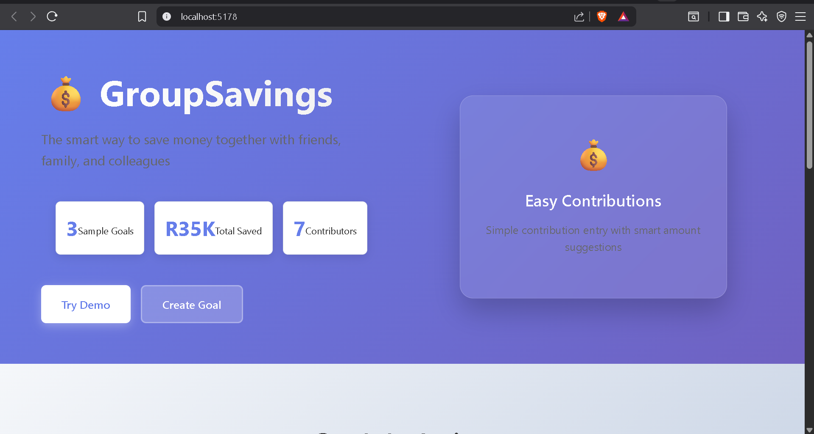
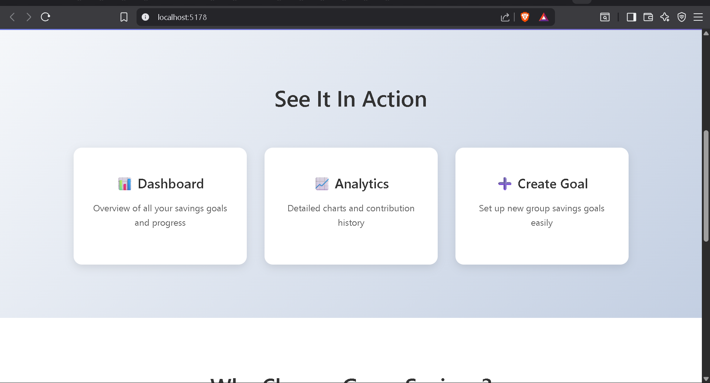
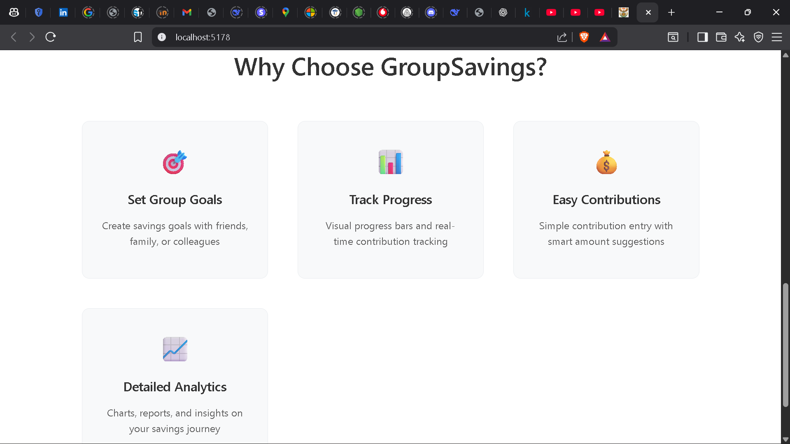
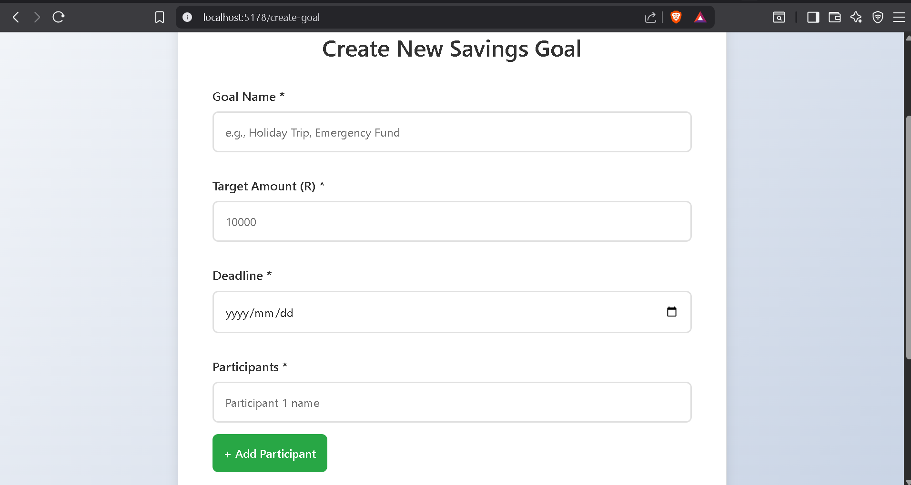
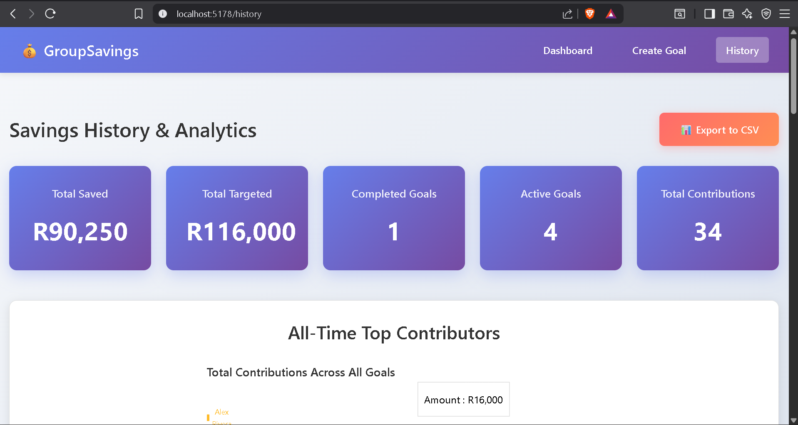
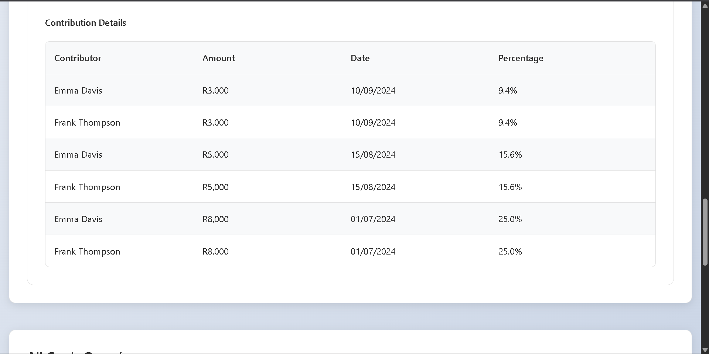
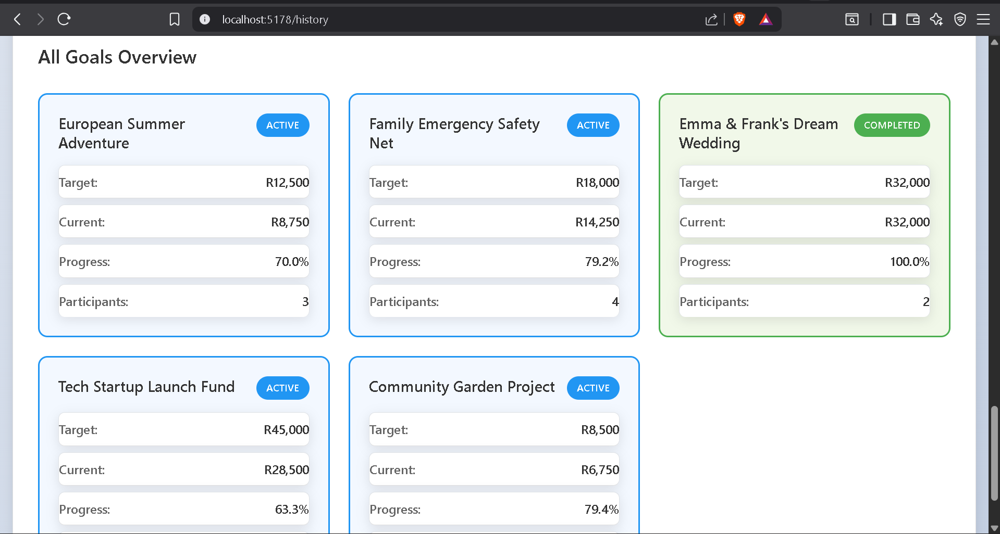
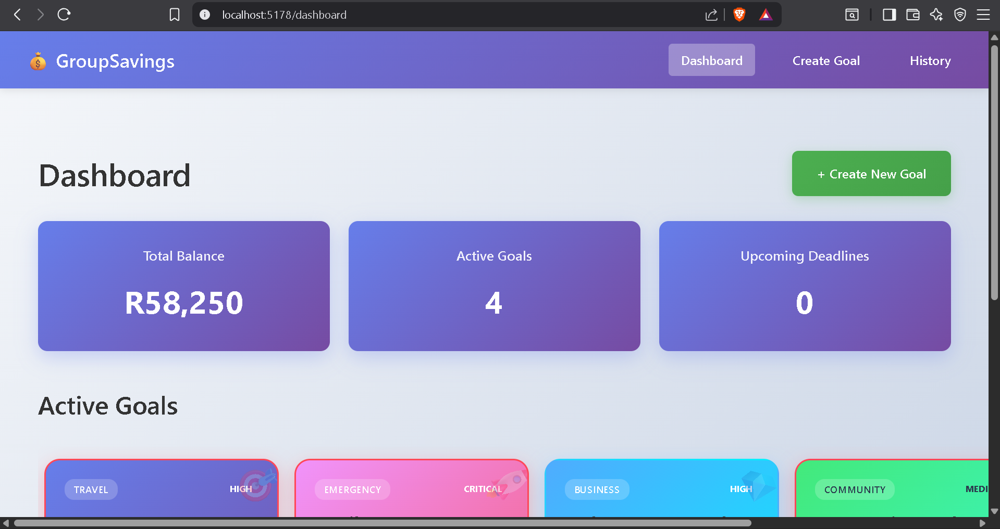
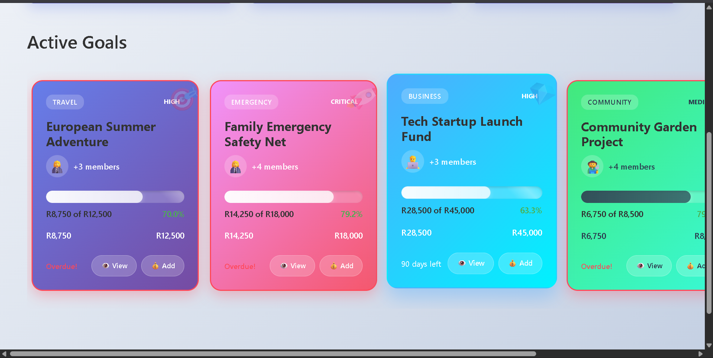

# 💰 GroupSavings - Collaborative Savings Tracker

A modern React application for tracking group savings goals with real-time ### 🌟 GitHub Features

### ⭐ Star this repository if you find it useful!

### 🚀 Quick Demo
Visit the live demo: [GroupSavings Demo](https://herry360.github.io/groupsaving)ss monitoring, contribution management, and detailed analytics.

## 🌟 Features

### 📊 Dashboard
- **Overview of all active goals** with progress bars
- **Total balance** across all savings goals
- **Upcoming deadline reminders** (goals due within 30 days)
- **Quick actions** to create new goals or add contributions

### 🎯 Goal Management
- **Create new savings goals** with custom targets and deadlines
- **Add multiple participants** to each goal
- **Track progress** with visual progress bars
- **View detailed goal analytics** and participant breakdowns

### 💸 Contribution Tracking
- **Easy contribution entry** with participant selection
- **Smart amount suggestions** (suggested, half, complete goal)
- **Contribution history** for each participant
- **Real-time goal progress updates**

### 📈 Analytics & History
- **Completed goals overview** with detailed analytics
- **Contribution timeline charts** showing progress over time
- **Pie charts** for contributor breakdowns
- **All-time statistics** and top contributors
- **CSV export** functionality for data backup

### 🎨 Modern UI/UX
- **Responsive design** that works on desktop and mobile
- **Gradient backgrounds** and modern card layouts
- **Interactive charts** powered by Recharts
- **Smooth animations** and hover effects
- **Intuitive navigation** with React Router

## 🛠️ Tech Stack

- **Frontend Framework**: React 19.1.1
- **Build Tool**: Vite
- **Routing**: React Router DOM
- **Charts**: Recharts
- **Styling**: CSS3 with custom variables and gradients
- **Data**: JSON-based dummy data (easily replaceable with real backend)

## 🚀 Getting Started

### Prerequisites
- Node.js (version 14 or higher)
- npm or yarn package manager

### Installation

1. **Clone the repository**
   ```bash
   git clone https://github.com/yourusername/groupsaving.git
   cd groupsaving
   ```

2. **Install dependencies**
   ```bash
   npm install
   ```

3. **Start the development server**
   ```bash
   npm run dev
   ```

4. **Open your browser** and navigate to `http://localhost:5173`

### Available Scripts

- `npm run dev` - Start development server
- `npm run build` - Build for production
- `npm run preview` - Preview production build
- `npm run lint` - Run ESLint

## 📂 Project Structure

```
src/
├── components/          # Reusable UI components
│   ├── Navbar.jsx      # Navigation component
│   ├── ProgressBar.jsx # Progress visualization
│   ├── ChartPie.jsx    # Pie chart component
│   └── ContributionCard.jsx # Individual contribution display
├── screens/            # Main application screens
│   ├── Dashboard.jsx   # Main dashboard view
│   ├── CreateGoal.jsx  # Goal creation form
│   ├── GoalDetails.jsx # Detailed goal view
│   ├── Contribution.jsx # Contribution entry form
│   └── History.jsx     # Analytics and history
├── data/              # Static data files
│   └── goals.json     # Sample goals and contributions
├── App.jsx            # Main app component with routing
├── main.jsx          # Application entry point
└── index.css         # Global styles
```

## 🎯 Sample Data

The application comes with sample data including:

- **3 sample goals**: Holiday Trip, Emergency Fund, Wedding Fund
- **Multiple participants**: Alice, Bob, Harry, Charlie, Diana, Emma, Frank
- **Various contribution amounts** and dates
- **Different goal statuses**: Active and Completed

## 🔧 Customization

### Adding Real Backend Integration

To connect to a real backend:

1. **Replace data imports** in components with API calls
2. **Add state management** (Redux, Zustand, or Context API)
3. **Implement authentication** for user management
4. **Add real-time updates** with WebSockets or polling

---

**Built with ❤️ using React and modern web technologies**

## 🌟 GitHub Features

### ⭐ Star this repository if you find it useful!

### 🚀 Quick Demo
Visit the live demo: [GroupSavings Demo](https://yourusername.github.io/groupsaving)

### 📸 Screenshots
<details>
<summary>Click to view application screenshots</summary>

#### 🏠 Landing Page

*Modern landing page with feature highlights and call-to-action buttons*

#### 📊 Dashboard Overview

*Main dashboard showing active goals with horizontal scrolling wild cards*

#### 🎯 Goal Creation

*Intuitive goal creation form with participant management*

#### � Goal Details & Progress

*Detailed goal view with progress tracking and contribution history*

#### 💰 Contribution Entry

*Easy contribution entry with smart amount suggestions*

#### 📈 Analytics & History

*Comprehensive analytics with charts and statistics*

#### 📊 Detailed Charts

*Interactive contribution timeline and pie charts*

#### 🏆 Goal Completion

*Completed goals view with success indicators*

#### 📋 All Goals Overview

*Complete overview of all goals with status indicators*

</details>

### 🔧 Development Status
- ✅ Core functionality complete
- ✅ Responsive design
- ✅ Interactive charts
- ✅ Sample data included
- 🔄 Backend integration (planned)
- 🔄 User authentication (planned)
- 🔄 Payment integration (planned)

### 🤝 Contributing
Contributions are welcome! Please feel free to submit a Pull Request.

### 📊 Project Stats


